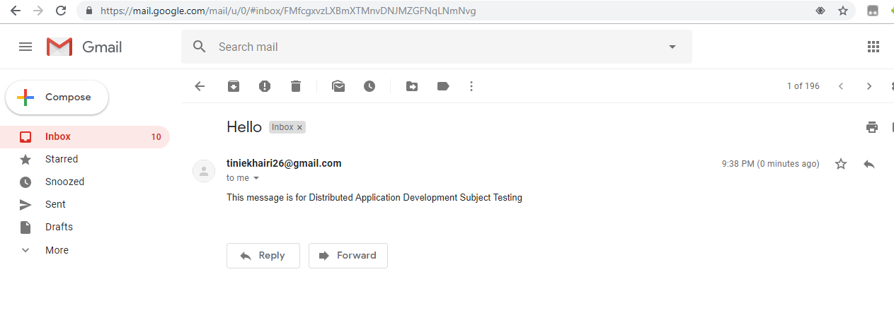
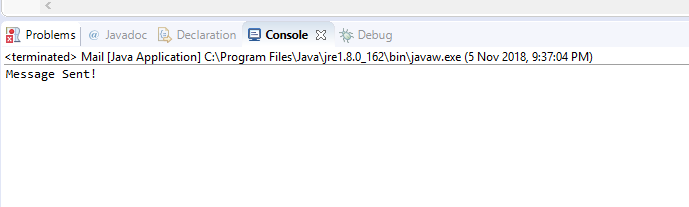

#Lab Activity – Self Exploration

Choose one of the public API and understand the documentation. 
JavaMailAPI

1)	List out the parameters that the API able to receive. 
Answers: 
1. String username
2. String password
3. setFrom – the sender/client
4. setRecipients – the receiver/server
5. setSubject – the title of the message
6. setText – the content of the message

2)	List out are the responses that the API return (the JSON values).
Answers: 
1. For username and password – return String
2. setFrom – return the sender address of parameter.
3. setRecipients – return the receiver address of parameter.
4. setSubject – return the value of text parameter. Returns null if the parameter is not present.
5. setText – return the content value of the parameter. Returns null if the parameter is not present.

Github URL repository: https://github.com/tiniekhairi

OUTPUT:

 
 
 
 
 

 
 

